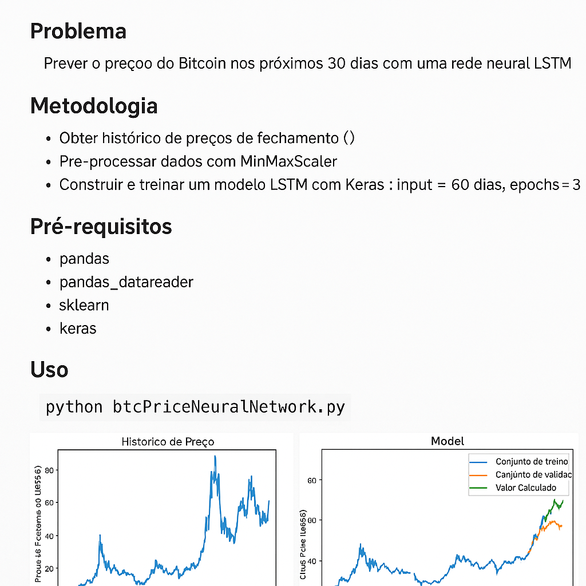

# 🧠 Previsão de Preços do Bitcoin com LSTM


Este projeto utiliza redes neurais recorrentes (LSTM) para prever os preços do Bitcoin com base em dados históricos. O objetivo é treinar um modelo capaz de prever os preços para os próximos 30 dias.

---

## 📈 Resultados


---

## 🛠 Tecnologias utilizadas

- Python
- Pandas
- Pandas DataReader
- Scikit-learn
- Keras
- Matplotlib
- Quandl API

---

## 📂 Estrutura do Projeto

- `btcPriceNeuralNetwork.py`: Script principal com toda a lógica de importação, preparação dos dados, treinamento do modelo, previsão e visualização.
- `requirements.txt`: Dependências do projeto.
- `30dayPredict.png.png`: Imagem com a previsão para os próximos 30 dias.
- `priceHistory.png`: Histórico dos preços utilizados para treinamento/validação.

---

## ⚙️ Como executar

1. Clone o repositório:
   ```bash
   git clone https://github.com/daniloercosta/Analise-de-dados---Python---Panda.git
   cd Analise-de-dados---Python---Panda
Instale as dependências:

bash
Copiar
Editar
pip install -r requirements.txt
Configure sua chave de API do Quandl substituindo a linha:

python
Copiar
Editar
api_key='%%YOUR API KEY HERE%%'
por:

python
Copiar
Editar
api_key='SUA_CHAVE_AQUI'
Execute o script:

bash
Copiar
Editar
python btcPriceNeuralNetwork.py
🔍 Detalhes Técnicos
A rede LSTM utiliza janelas deslizantes de 60 dias para prever o próximo valor.

O modelo é treinado com 60% dos dados, e os 40% restantes são usados para teste.

Após a previsão dos dados conhecidos, o modelo realiza inferência para os próximos 30 dias.

O erro quadrático médio (RMSE) é calculado para avaliar a performance da predição.

📬 Contato
Se quiser trocar ideia sobre o projeto ou tiver alguma dúvida, entre em contato:

GitHub: daniloercosta
